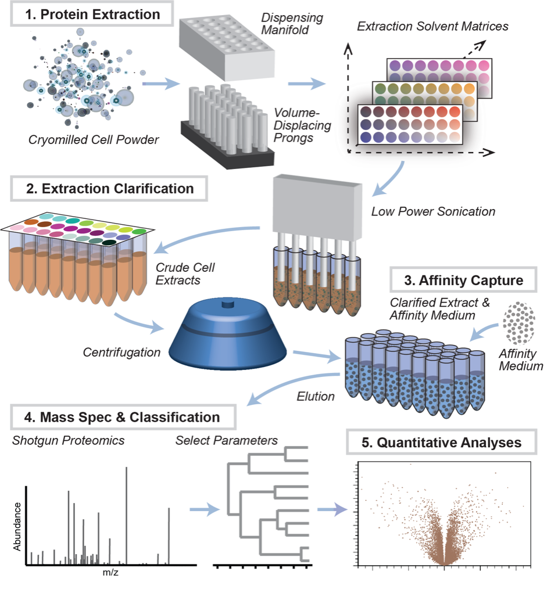

# ncbp-pipeline
##### Data are available via ProteomeXchange with identifier PXD016038.
##### contact moghbaie@rockefeller.edu for any questions
##### 12/27/2019

Project code and data is organized in following order:

* [src](src/)
* [Input_data](data/)
* [Output](out/)

## Schematic representation of interaction screening:

</img>

## Buffers used for the screens: 

|	Screen	|	Buffer no.	|	Buffer	|	Buffer Concentration	| 	Salt	| Salt concentration	| Detergent |	Detergent Concentration		|	pH|
| ------------- | ------------- |------------- | ------------- |------------- |------------- |------------- |------------- | ------------- |
| NCBP1, 2, 3  | 7 |	HEPES-Na	|	20 mM	|	NaCl	| 150 mM |	d-BCHAP|	5mM	|	7.4 |
| NCBP1, 2, 3  | 10  |	HEPES-Na	|	20 mM	|	NaCl	| 300 mM  |	Sarcosyl	|	0.5mM	|	7.4 |
| NCBP1, 2, 3  | 12  |	HEPES-Na	|	20 mM	|	NaCl	| 150 mM  |	TRIT X100	|	0.5 % v/v |	7.4 |
|	NCBP1, 2, 3 | 14  |	HEPES-Na	|	20 mM	|	MgCl2	| 50 mM  |	TRIT X100	|	0.5 % v/v |	7.4 |
|	NCBP1, 2, 3	|	18	|	NH4 Acet	|	125 mM	|	NaCl	| 100 mM |	TRIT X100	|	1 % v/v |	7 |
|	NCBP1, 2, 3	|	20	|	TRIS-Cl	|	20 mM	|	Na3 Cit	| 125 mM  |	TRIT X100	|	1 % v/v |	8 |

